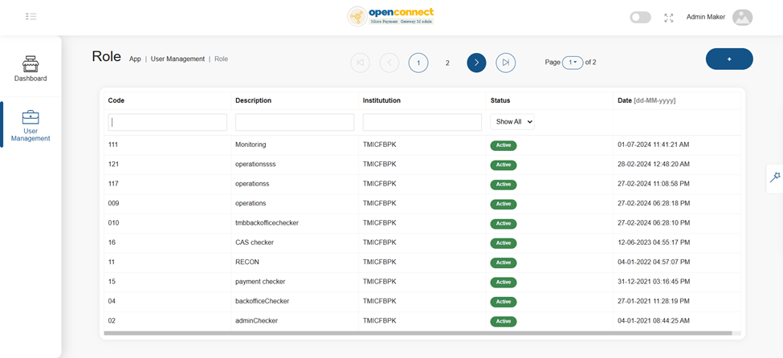
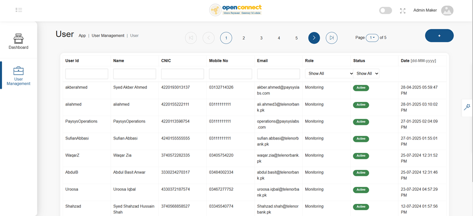

## PAYSYS
## 2025

**Open Connect – Eth Switch Integration – Functional Specification Document**

This document and the information contained herein are confidential. Without Paysys’s prior written permission, this document, either in whole or in part, may not be reproduced in any form or by any means or disclosed to others.

## Document Details

**Version: 1.2**

**Creation Date: 08th Apr 2025**

**Last Modification Date: 06th May 2025**

## Revision History

| Date | Version  | Prepared By/Modified By | Reviewed By | Version Summary |
|------|----------|-------------------------|-------------|-----------------|
|      |          |                         |             |                 |
|      |          |                         |             |                 |

## Document Sign-off Form

| Personnel     | Organization      | Designation/Role | Signoff Signature | 
|---------------|-------------------|------------------|-------------------|
|               |                   |                  |                   |
|               |                   |                  |                   |   
    Project Title: Open Connect – Eth Switch Integration – FSD v 1.2 (Phase I)    

# Table of Contents
 - 
    - [1 Introduction](#1-introduction)
      - [1.1 Integration strategies](#11-integration-strategies)
        - [1.1.1 Approach 1: IPS integration - Direct Posting](#111-approach-1-ips-integration---direct-posting)
        - [1.1.2 Approach 2: IPS Integration - Debit Managed by OC](#112-approach-2-ips-integration---debit-managed-by-oc)
      - [1.2 Business Logic (BL) - Unified Layer](#12-business-logic-bl---unified-layer)
      - [1.3 Open Connect - IPS Interface](#13-open-connect-ips-interface)
      - [1.4 Open Connect - Host Interface](#14-open-connect-host-interface)
    - [2 Solution Architecture: Hybrid Model](#2-solution-architecture-hybrid-model)
      - [2.1 Bank OC setup into ETH Switch infrastructure](#21-bank-oc-setup-into-eth-switch-infrastructure)
      - [2.2 Bank OC setup into bank infrastructure](#22-bank-oc-setup-into-bank-infrastructure)
    - [3 Required Infrastructure Architecture](#3-required-infrastructure-architecture)
      - [3.1 Hardware specification (TPS wise slab)](#31-hardware-specification-tps-wise-slab)
      - [3.2 Software specification](#32-software-specification)
    - [4 Transaction Integration](#4-transaction-integration)
      - [4.1 Instant transfers (P2P) – Outbound - Non-Financials](#41-instant-transfers-p2p-outbound-non-financials)
        - [4.1.1 Account Identification](#411-account-identification)
        - [4.1.2 Transaction Inquiry](#412-transaction-inquiry)
          - [4.1.2.1 Transaction Inquiry Completed with “Success” status](#4121-transaction-inquiry-completed-with-success-status)
          - [4.1.2.2 Transaction Inquiry Completed with “Rejected” status](#4122-transaction-inquiry-completed-with-rejected-status)
          - [4.1.2.3 Transaction Inquiry Completed with “Transaction not found” status](#4123-transaction-inquiry-completed-with-transaction-not-found-status)
      - [4.2 Instant transfers (P2P) – Outbound - Financials](#42-instant-transfers-(p2p)-outbound---financials)
        - [4.2.1 Scenario 1 – Payment Executed successfully](#421-scenario-1-payment-executed-successfully)
        - [4.2.2 Scenario 2 – Payment Executed successfully via Inquiry](#422-scenario-2-–-payment-executed-successfully-via-inquiry)
        - [4.2.3 Scenario 3 – Payment Rejected by counterparty](#423-scenario-3-payment-rejected-by-counterparty)
        - [4.2.4 Scenario 4 – Payment Rejected by IPS](#424-scenario-4-payment-rejected-by-ips)
        - [4.2.5 Scenario 5 – Payment Rejected by OC](#425-scenario-5-payment-rejected-by-oc)
        - [4.2.6 Scenario 6 – Payment Marked as TIP (Transaction In Process)](#426-scenario-6-payment-marked-as-tip-(transaction-in-process))
        - [4.3.1 Title Fetch](#431-title-fetch-1)
      - [4.4 Instant transfers (P2P) – Inbound - Financials](#44-instant-transfers-p2p-–-inbound---financials)
        - [4.4.1 Scenario 1 – Payment Executed successfully](#441-scenario-1-payment-executed-successfully)
        - [4.4.2 Scenario 2 – Payment Completed by credit inquiry](#442-scenario-2-payment-completed-by-credit-inquiry)
        - [4.4.3 Scenario 3 – Account verification rejected by Host](#443-scenario-3-account-verification-rejected-by-host)
        - [4.4.4 Scenario 4 – Credit request rejected by host; instant return initiated](#444-scenario-4-–-credit-request-rejected-by-host;-instant-return-initiated)
        - [4.4.5 Scenario 5 – Credit request got timeout and inquiry got timeout](#445-scenario-5-credit-request-got-timeout-and-inquiry-got-timeout)
    - [5 Backoffice](#5-backoffice)
      - [5.1 Admin Portal](#51-admin-portal)
        - [5.1.1 Role Management](#511-role-management)
        - [5.1.2 User Management](#512-user-management)
        - [5.1.3 Dashboard](#513-dashboard)
        - [5.1.4 Audit Logging](#514-audit-logging)
      - [5.2 Operations & Transaction Management](#52-operations-transaction-management)
        - [5.2.1 Transaction Search](#521-transaction-search)
        - [5.2.2 Transaction View](#522-transaction-view)
        - [5.2.3 SAF Monitoring and Re-transmission](#523-saf-monitoring-and-re-transmission)
        - [5.2.4 Process Return Payments](#524-process-return-payments)
      - [5.3 Reports](#53-reports)

## 1 **Introduction**

### 1.1 **Integration strategies**

OpenConnect, offers two integration methods for the bank’s channels for all outward payments. The bank can opt for anyone on this basis on their technical readiness and systems compatibility.

#### 1.1.1 **Approach 1: IPS integration - Direct Posting**

The option allows banks to do integration with the OpenConnect in a model where debit on the customer/sender account will be managed by bank system itself and OpenConnect will manage the IPS end only. The decision will be made based on the technical design approach by the bank’s architecture team.

The diagram below states the high-level flow of the transaction journey:

#### 1.1.2 **Approach 2: IPS Integration - Debit Managed by OC**

The option allows banks to do integration where debit leg for the core banking system of sender end will be managed by the Open Connect. The approach extensively offers the following:

* Debit hold / funds block before sending payment request to IPS

* Debit confirmation on payment acceptance from IPS

* Debit release on payment rejection from IPS

* Limit management

### 1.2 **Business Logic (BL) - Unified Layer**

The Unified Layer is a comprehensive API framework designed to facilitate seamless connectivity between multiple channels and the Instant Payment System (IPS) platform. It supports a diverse range of transaction types, including:

* Financial Transactions

    * Peer-to-Peer (P2P) Transactions

    * Peer-to-Merchant (P2M) Transactions

* Non-Financial Transactions

    * Alias Management

    * Transaction Inquiry

    * Title Fetch / Account Inquiry

    * Request for Return Payment Messages

**Secure & Scalable API Infrastructure**

The API layer exposes (REST APIs) endpoints to channel and adheres to industry-leading secure development standards, ensuring compliance and data protection. It enables multiple channels to securely connect to the IPS platform, utilizing their respective credentials and secret keys for authentication.

### 1.3 **Open Connect - IPS Interface**

Open Connect is a cutting-edge, fully integrated, and exceptionally scalable payment switch platform, distinguished by its efficient service-oriented architecture. This platform operates independently and boasts a robust multitenant design. Its messaging technology is centered around the RabbitMQ Queue Manager, a highly scalable RabbitMQ queuing system capable of horizontal scaling across a cluster of machines. Whether in a virtual or containerized environment, Open Connect's deployment is seamless.

**Integration Switch:**

The OC platform serves as the foundational cornerstone for unified integration with various systems within a financial institution. Key Integrations via Open Connect:

* IPS Platform Interface

  * Person to person

  * ALIAS Management (Central Addressing Scheme)

  * Person to Merchant

    * Issuing

    * Acquiring

  * Bulk Transfers

    * Receiving

    * Sending

### 1.4 **Open Connect - Host Interface**

Open Connect seamlessly facilitates simultaneous interfacing with multiple systems while providing robust support for the following integration methods:

* REST Services

* SOAP Services

* Iso 8583

* Iso 20222

* TCP Messages

* Queue-Based Integration

Open Connect offers a dedicated micro service for the host integration which provides an ease in integration methodology and provides better performance for the transactions.

## 2 **Solution Architecture: Hybrid Model**

The infrastructure architecture has been designed with a focus on high availability and redundancy at both the Primary (PR) and Disaster Recovery (DR) sites.

The diagram below illustrates the complete solution architecture, depicting Bank 1 and Bank 2 hosted within an Ethernet switch environment, while Banks 3 and 4 are hosted within the bank's infrastructure. The proposed architecture follows a hybrid model, allowing banks to choose between a Software-as-a-Service (SaaS) deployment or an on-premises hosting model. The SaaS model offers banks the advantage of faster environment setup and streamlined implementation processes.

### 2.1 **Bank OC setup into ETH Switch infrastructure**

### 2.2 **Bank OC setup into bank infrastructure**

## 3 **Required Infrastructure Architecture**

### 3.1 **Hardware specification (TPS wise slab)**

Considering the use cases and transactions scope we have compute the infrastructure requirements to setup the application. The mentioned TPS is per bank, the Middleware (OC) machine will be setup multiple as per number of banks which select ETH switch to manage the Open Connect for their IPS connectivity and integration.

The infrastructure for the Primary (PR) and Disaster Recovery (DR) sites will be identical. However, the test environment will have a different infrastructure with lower specifications.

**Support up to 10 TPS:**

**Support up to 20 TPS:**

**Support up to 30 TPS:**

### 3.2 **Software specification**

* Application tested on Redhat Enterprise Linux as OS but can operate on other versions of Linux also. The infrastructure applications / OS will be finalized in the implementation phase.

* The application uses

  * RabbitMQ

  * Memcached

  * Redis Cache

* SSL Certificate

* Domain Name (for SSL)

* Cloudflare (WAF) required for internet facing traffic

* NGINX Plus Enterprise Edition

* SQL Server enterprise edition

## 4 **Transaction Integration**

The section covers a brief journey for the financial & non-financial transactions, and the integration between channel, bank backend system, Open connect and IPS.

### 4.1 **Instant transfers (P2P) – Outbound - Non-Financials**

#### 4.1.1 **Account Identification**

Prior to initiating the payment, customers are required to do beneficiary account validation. The method allows sending bank to validate beneficiary account is valid and is in active state. The receiver bank is responsible for all required validations.
| **Requester Action(s)** | **Process Description** |
|-------------------------|--------------------------|
| **Channel** | - Sent request for title fetch with beneficiary account identifier and receiver participant BIC |
| **Bank System** | - Receive request from channel for account identification    - Sent request to Open Connect with following key parameters:    &nbsp;&nbsp;&nbsp;&nbsp;• Beneficiary account identifier    &nbsp;&nbsp;&nbsp;&nbsp;• Bank BIC |
| **OC** | - Receive request for account identification    - Authenticate request    - Validate request    - Prepare ACMT.023 for IPS    - Sent request to IPS |
| **IPS** | - Validate signature    - Validate request    - Identify the destination bank    - Sent request to destination bank |
| **Destination Bank** | - Validate request    - Perform account inquiry against beneficiary account identifier    - Prepare ACMT.024 (account identification response)    - Response back to IPS with customer title and other required parameters |
| **IPS** | - Receive response from bank    - Respond back to OC |
| **OC** | - Receive response from IPS    - Response back to initiator with following key parameters in response:    &nbsp;&nbsp;&nbsp;&nbsp;• Customer account title    &nbsp;&nbsp;&nbsp;&nbsp;• Title fetch unique reference id |
| **Bank System** | - Response back to channel with beneficiary account info |
| **Channel** | - Display following to customer for payment confirmation:    &nbsp;&nbsp;&nbsp;&nbsp;• Beneficiary name    &nbsp;&nbsp;&nbsp;&nbsp;• Beneficiary account identifier    &nbsp;&nbsp;&nbsp;&nbsp;• Transaction Amount    &nbsp;&nbsp;&nbsp;&nbsp;• Other payment details |

<!--- [Open Connect - Title Fetch](./OCTitleFetch.png)] --->

#### 4.1.2 **Transaction Inquiry**

The API allows banks to make transaction inquiries for previously made outward transactions. The API will be called when original transaction faith do not receive to bank for any technical reason for e.g. (network disruption, application disruption etc.). In this scenario, the bank will be able to fetch the status of original transactions.

##### 4.1.2.1 **Transaction Inquiry Completed with “Success” status**

| **Requester Action(s)** | **Process Description** |
|-------------------------|--------------------------|
| **Bank System** | - Prepare request for transaction inquiry    - Sent request to Open Connect with following key parameters:    &nbsp;&nbsp;&nbsp;&nbsp;• Request params    &nbsp;&nbsp;&nbsp;&nbsp;• Original transaction reference |
| **OC** | - Receive request for transaction inquiry    - Validate request    - Validate request    - Prepare Pacs.028 for IPS    - Sent request to IPS |
| **IPS** | - Validate signature    - Validate request    - Look for the original transaction, identified as successful transaction    - Sent pacs.002 ‘ACSP’ in response |
| **OC** | - Receive response from IPS    - Update transaction status, sync the status with IPS    - Response back to initiator transaction status |
| **Bank System** | - Update transaction status    - Transaction Posting:    &nbsp;&nbsp;&nbsp;&nbsp;• Post financial entries if originally not posted or transaction is marked as “TIP”    &nbsp;&nbsp;&nbsp;&nbsp;• Sent notification to customer |

##### 4.1.2.2 **Transaction Inquiry Completed with “Rejected” status**

| **Requester Action(s)** | **Process Description** |
|-------------------------|--------------------------|
| **Bank System** | - Prepare request for transaction inquiry    - Sent request to Open Connect with following key parameters:    &nbsp;&nbsp;&nbsp;&nbsp;• Request params    &nbsp;&nbsp;&nbsp;&nbsp;• Original transaction reference |
| **OC** | - Receive request for transaction inquiry    - Validate request    - Validate request    - Prepare Pacs.028 for IPS    - Sent request to IPS |
| **IPS** | - Validate signature    - Validate request    - Look for the original transaction, identified as failed transaction    - Sent pacs.002 ‘RJCT’ in response |
| **OC** | - Receive response from IPS    - Update transaction status, sync the status with IPS    - Response back to initiator transaction status |
| **Bank System** | - Update transaction status    - Transaction Posting:    &nbsp;&nbsp;&nbsp;&nbsp;• Post financial entries if originally not posted or transaction is marked as “TIP”    &nbsp;&nbsp;&nbsp;&nbsp;• Sent notification to customer |

##### 4.1.2.3 **Transaction Inquiry Completed with “Transaction not found” status**

| **Requester Action(s)** | **Process Description** |
|-------------------------|--------------------------|
| **Bank System** | - Prepare request for transaction inquiry    - Sent request to Open Connect with following key parameters:    &nbsp;&nbsp;&nbsp;&nbsp;• Request params    &nbsp;&nbsp;&nbsp;&nbsp;• Original transaction reference |
| **OC** | - Receive request for transaction inquiry    - Validate request    - Validate request    - Prepare Pacs.028 for IPS    - Sent request to IPS |
| **IPS** | - Validate signature    - Validate request    - Look for the original transaction, original transaction not found    - Respond with CAMT.025 |
| **OC** | - Receive response from IPS    - Update transaction status, sync the status with IPS    - Response back to initiator transaction status |
| **Bank System** | - Update transaction status    - Transaction Posting:    &nbsp;&nbsp;&nbsp;&nbsp;• Post financial entries if originally not posted or transaction is marked as “TIP”    &nbsp;&nbsp;&nbsp;&nbsp;• Sent notification to customer |

### 4.2 **Instant transfers (P2P) – Outbound - Financials**

#### 4.2.1 **Scenario 1 – Payment Executed successfully**

The section outlines the flow for the outward payments, where bank’s system will debit the customer account prior to sent the payment request to the IPS via OpenConnect middleware. The OC middleware will be responsible for:

* Validate request

* Prepare pacs.008 payment request

* Digital signature for the payment using participant params

* Process and manage the response with IPS

| **Requester Action(s)** | **Process Description** |
|-------------------------|--------------------------|
| **Channel** | - Customer confirms details for beneficiary    - Customer authorized the transaction using app authentication mechanism |
| **Bank System** | - Customer sent request for payment    - App backend validate request    - Validate customer limit    - Prepare unique transaction id    - Sent debit hold request to core banking with unique transaction identifier |
| **Core Banking** | - Validate request    - Validate sender account    - Hold funds from sender account    - Respond back to backend |
| **Bank System** | - Sent request to Open Connect for outward payment with following key details:    &nbsp;&nbsp;&nbsp;&nbsp;• Sender info    &nbsp;&nbsp;&nbsp;&nbsp;• Receiver info    &nbsp;&nbsp;&nbsp;&nbsp;• Transaction info    &nbsp;&nbsp;&nbsp;&nbsp;• Transaction unique identifier |
| **Open Connect** | - Validate token    - Validate request    - Prepare pacs.008 (payment request) for IPS with digital signature    - Sent request to IPS |
| **IPS** | - Validate signature    - Validate request    - Hold sender funds    - Sent request to receiving bank |
| **Receiving Bank** | - Validate request    - Do account validation    - Prepare payment authorization message ([Pacs.002 ACSP](#))    - Sent response to IPS |
| **IPS** | - Validate signature    - Validate request    - Debit sender bank account    - Credit receiver bank account    - Sent payment confirmation (Pacs.002 ‘ACSP’) to both participants simultaneously |
| **Open Connect** | - Received payment confirmation with ‘ACSP’ from IPS    - Update transaction status    - Mark transaction as completed    - Prepare response for the initiator |
| **Bank System** | - Receive transaction successful response from OC    - Sent debit confirmation to core banking    - Sent payment result to channel |
| **Channel** | - Display appropriate message to customer |
| **Core Banking (Sender)** | - Receive payment result from the backend    - Debit customer account    - Sent notification to the customer |
| **Receiving Bank** | - Received payment confirmation with ‘ACSP’ from IPS    - Credit beneficiary account    - Sent notification to the receiver |

<!---  --->

#### 4.2.2 **Scenario 2 – Payment Executed successfully via Inquiry**

| **Requester Action(s)** | **Process Description** |
|-------------------------|--------------------------|
| **Channel** | - Customer confirms details for beneficiary    - Customer authorized the transaction using app authentication mechanism |
| **Bank System** | - Customer sent request for payment    - App backend validate request    - Validate customer limit    - Prepare unique transaction id    - Sent debit hold request to core banking with unique transaction identifier |
| **Core Banking** | - Validate request    - Validate sender account    - Hold funds from sender account    - Respond back to backend |
| **Bank System** | - Sent request to Open Connect for outward payment with following key details:    &nbsp;&nbsp;&nbsp;&nbsp;• Sender info    &nbsp;&nbsp;&nbsp;&nbsp;• Receiver info    &nbsp;&nbsp;&nbsp;&nbsp;• Transaction info    &nbsp;&nbsp;&nbsp;&nbsp;• Transaction unique identifier |
| **Open Connect** | - Validate token    - Validate request    - Prepare pacs.008 (payment request) for IPS with digital signature    - Sent request to IPS |
| **IPS** | - Validate signature    - Validate request    - Hold sender funds    - Sent request to receiving bank |
| **Receiving Bank** | - Validate request    - Do account validation    - Prepare payment authorization message ([Pacs.002 ACSP](#))    - Sent response to IPS |
| **IPS** | - Validate signature    - Validate request    - Debit sender bank account    - Credit receiver bank account    - Sent payment confirmation (Pacs.002 ‘ACSP’) to both participants simultaneously |
| **Open Connect** | - Received payment confirmation with ‘ACSP’ from IPS    - Update transaction status    - Mark transaction as completed    - Prepare response for the initiator |
| **Bank System** | - *Do not receive response from Open Connect*    - Initiate transaction inquiry |
| **Open Connect** | - Received transaction inquiry    - Validate token    - Validate request    - Prepare pacs.028 (Transaction Inquiry) |
| **IPS** | - Received pacs.028 from Open Connect    - Validate signature    - Validate request    - Respond back with Pacs.002 with original transaction status i.e. ACSP/RJCT |
| **Open Connect** | - Transaction status already updated and synced with IPS    - Prepare response for the initiator |
| **Bank System** | - Receive transaction successful response from Open Connect    - Sent debit confirmation to core banking    - Sent payment result to channel |
| **Channel** | - Display appropriate message to customer |
| **Core Banking (Sender)** | - Receive payment result from the backend    - Debit customer account    - Sent notification to the customer |
| **Receiving Bank** | - Received payment confirmation with ‘ACSP’ from IPS    - Credit beneficiary account    - Sent notification to the receiver |

<!---  --->

#### 4.2.3 **Scenario 3 – Payment Rejected by counterparty**

| **Requester Action(s)** | **Process Description** |
|-------------------------|--------------------------|
| **Channel** | - Customer confirms detail for beneficiary    - Customer authorized the transaction using app authentication mechanism    - Customer sent request for payment |
| **Bank System** | - App backend validate request    - Validate customer limit    - Prepare unique transaction id    - Sent debit hold request to core banking with unique transaction identifier |
| **Core Banking** | - Validate request    - Validate sender account    - Hold funds from sender account    - Respond back to backend |
| **Bank System** | - Sent request to Open Connect for outward payment with following key details:    &nbsp;&nbsp;&nbsp;&nbsp;• Sender info    &nbsp;&nbsp;&nbsp;&nbsp;• Receiver info    &nbsp;&nbsp;&nbsp;&nbsp;• Transaction info    &nbsp;&nbsp;&nbsp;&nbsp;• Transaction unique identifier |
| **Open Connect** | - Validate token    - Validate request    - Prepare pacs.008 (payment request) for IPS with digital signature    - Sent request to IPS |
| **IPS** | - Validate signature    - Validate request    - Hold sender funds    - Sent request to receiving bank |
| **Receiving Bank** | - Validate request    - Do account validation, account validation failed    - Prepare payment authorization message ([Pacs.002 RJCT](#))    - Sent response to IPS |
| **IPS** | - Validate signature    - Validate request    - Release sender bank funds    - Sent payment result (Pacs.002 ‘RJCT’) to both participants simultaneously |
| **Open Connect** | - Received payment result with ‘RJCT’ from IPS    - Update transaction status    - Mark transaction as completed    - Prepare response for the initiator |
| **Bank System** | - Receive transaction failure response from OC    - Sent debit release to core banking    - Sent payment result to channel |
| **Channel** | - Display appropriate message to customer |

<!---  --->

#### 4.2.4 **Scenario 4 – Payment Rejected by IPS**

| **Requester Action(s)** | **Process Description** |
|-------------------------|--------------------------|
| **Channel** | - Customer confirms detail for beneficiary    - Customer authorized the transaction using app authentication mechanism    - Customer sent request for payment |
| **Bank System** | - App backend validate request    - Validate customer limit    - Prepare unique transaction id    - Sent debit hold request to core banking with unique transaction identifier |
| **Core Banking** | - Validate request    - Validate sender account    - Hold funds from sender account    - Respond back to backend |
| **Bank System** | - Sent request to Open Connect for outward payment with following key details:    &nbsp;&nbsp;&nbsp;&nbsp;• Sender info    &nbsp;&nbsp;&nbsp;&nbsp;• Receiver info    &nbsp;&nbsp;&nbsp;&nbsp;• Transaction info    &nbsp;&nbsp;&nbsp;&nbsp;• Transaction unique identifier |
| **Open Connect** | - Validate token    - Validate request    - Prepare pacs.008 (payment request) for IPS with digital signature    - Sent request to IPS |
| **IPS** | - Validate signature    - Validate request    - Hold sender funds, funds not available    - Respond with ADMI.002 |
| **Open Connect** | - Received rejection message from IPS    - Update transaction status    - Mark transaction as completed    - Prepare response for the initiator |
| **Bank System** | - Receive transaction failure response from OC    - Sent debit release to core banking    - Sent payment result to channel |
| **Channel** | - Display appropriate message to customer |

<!---  --->

#### 4.2.5 **Scenario 5 – Payment Rejected by OC**

| **Requester Action(s)** | **Process Description** |
|-------------------------|--------------------------|
| **Channel** | - Customer confirms detail for beneficiary    - Customer authorized the transaction using app authentication mechanism    - Customer sent request for payment |
| **Bank System** | - App backend validate request    - Validate customer limit    - Prepare unique transaction id    - Sent debit hold request to core banking with unique transaction identifier |
| **Core Banking** | - Validate request    - Validate sender account    - Hold funds from sender account    - Respond back to backend |
| **Bank System** | - Sent request to Open Connect for outward payment with following key details:    &nbsp;&nbsp;&nbsp;&nbsp;• Sender info    &nbsp;&nbsp;&nbsp;&nbsp;• Receiver info    &nbsp;&nbsp;&nbsp;&nbsp;• Transaction info    &nbsp;&nbsp;&nbsp;&nbsp;• Transaction unique identifier |
| **Open Connect** | - Validate token    - Validate request, request validation failed    - Respond back to initiator |
| **Bank System** | - Receive transaction failure response from OC    - Sent debit release to core banking    - Sent payment result to channel |
| **Channel** | - Display appropriate message to customer |

<!---  --->

#### 4.2.6 **Scenario 6 – Payment Marked as TIP (Transaction In Process)**

| **Requester Action(s)** | **Process Description** |
|-------------------------|--------------------------|
| **Channel** | - Customer confirms details for beneficiary    - Customer authorized the transaction using app authentication mechanism    - Customer sent request for payment |
| **Bank System** | - App backend validate request    - Validate customer limit    - Prepare unique transaction id    - Sent debit hold request to core banking with unique transaction identifier |
| **Core Banking** | - Validate request    - Validate sender account    - Hold funds from sender account    - Respond back to backend |
| **Bank System** | - Sent request to Open Connect for outward payment with following key details:    &nbsp;&nbsp;&nbsp;&nbsp;• Sender info    &nbsp;&nbsp;&nbsp;&nbsp;• Receiver info    &nbsp;&nbsp;&nbsp;&nbsp;• Transaction info    &nbsp;&nbsp;&nbsp;&nbsp;• Transaction unique identifier |
| **Open Connect** | - Validate token    - Validate request    - Prepare pacs.008 (payment request) for IPS with digital signature    - Sent request to IPS |
| **IPS** | - Validate signature    - Validate request    - Hold sender funds    - Sent request to receiving bank |
| **Receiving Bank** | - Validate request    - Do account validation    - Prepare payment authorization message ([Pacs.002 ACSP](#))    - Sent response to IPS |
| **IPS** | - Validate signature    - Validate request    - Debit sender bank account    - Credit receiver bank account    - Sent payment confirmation (Pacs.002 ‘ACSP’) to both participants simultaneously |
| **Open Connect** | - ❌ *Do not receive a response from IPS* |
| **Bank System** | - ❌ *Do not receive a response from OpenConnect*    - Initiate transaction inquiry |
| **Open Connect** | - Received transaction inquiry    - Validate token    - Validate request    - Prepare pacs.028 (Transaction Inquiry) |
| **IPS** | - Received pacs.028 from Open Connect    - Validate signature    - Validate request    - Respond back with Pacs.002 with original transaction status i.e. ACSP/RJCT |
| **Open Connect** | - ❌ *No response received from IPS for transaction inquiry as well*    - Prepare response for the initiator with timeout reason code    - Mark transaction as “TIP” |
| **Bank System** | - Receive transaction response from Open Connect with timeout reason code    - Do not release funds from customer accounts    - Sent payment result to channel |
| **Channel** | - Display appropriate message to customer i.e. “Transaction process successfully” |
| **Core Banking (Sender)** | - Receive payment result from the backend    - Debit customer account    - Sent notification to the customer |
| **Receiving Bank** | - Received payment confirmation with ‘ACSP’ from IPS    - Credit beneficiary account    - Sent notification to the receiver |

<!---  --->

**For transaction inquiries scenarios please refer to Section 4.1.2**

### 4.3 **Instant transfers (P2P) – Inbound - Non-Financials**

#### 4.3.1 **Title Fetch**

Sending bank initiate account identification request prior to payment, the bank is responsible to validate following:

* Account status is “Active” and can received funds

* If the credit limit is applicable, the limit will be available

* There is no other credit restriction on the account

OpenConnect receives account identification request from IPS, parse the message and sent the request to the receiving bank interface to verify the account and return the account information. On successful account verification OpenConnect respond back with account identification result (ACMT.024) message.

| **Requester Action(s)** | **Process Description** |
|-------------------------|--------------------------|
| **Sender** | - Sent request for title fetch with beneficiary account identifier and receiver participant BIC |
| **Bank System** | - Receive request from channel for account identification    - Sent request for account identification (ACMT.023) to IPS with following key parameters:    &nbsp;&nbsp;&nbsp;&nbsp;• Beneficiary account identifier    &nbsp;&nbsp;&nbsp;&nbsp;• Bank BIC |
| **IPS** | - Validate signature    - Validate request    - Identify the destination bank    - Sent request to destination bank |
| **OC (Receiving Service)** | - Receive account identification request (ACMT.023)    - Parse the request    - Prepare title fetch message for receiving bank |
| **Receiver Bank** | - Validate request    - Perform account inquiry against beneficiary account identifier    - Response back to OC with customer title and other required parameters |
| **OC (Receiving Service)** | - Validate response    - Prepare ACMT.024 (account identification response)    - Respond back to IPS |
| **IPS** | - Validate signature    - Validate request    - Respond back to initiator |
| **Bank System** | - Response back to channel with beneficiary account info |
| **Sender** | - Display following to customer for payment confirmation:    &nbsp;&nbsp;&nbsp;&nbsp;• Beneficiary name    &nbsp;&nbsp;&nbsp;&nbsp;• Beneficiary account identifier    &nbsp;&nbsp;&nbsp;&nbsp;• Transaction Amount    &nbsp;&nbsp;&nbsp;&nbsp;• Other payment details |

<!---  --->

### 4.4 **Instant transfers (P2P) – Inbound - Financials**

#### 4.4.1 **Scenario 1 – Payment Executed successfully**

| **Requester Action(s)** | **Process Description** |
|-------------------------|--------------------------|
| **Channel** | - Customer confirms details for beneficiary    - Customer authorized the transaction using app authentication mechanism    - Customer sent request for payment |
| **Sender Bank System** | - App backend validate request    - Validate customer limit    - Prepare unique transaction id    - Debit customer account    - Sent payment request (Pacs.008) |
| **IPS** | - Validate signature    - Validate request    - Hold sender funds    - Sent request to receiving bank |
| **OC** | - Validate request    - Parse request    - Prepare title fetch message for host    - Sent response to host |
| **Core Banking** | - Validate request    - Validate account    - Respond back to OC |
| **OC** | - Received response as “Success”    - Prepare response for IPS    - Sent payment confirmation (Pacs.002 ‘ACSP’) |
| **IPS** | - Validate signature    - Validate request    - Debit sender bank account    - Credit receiver bank account    - Sent payment confirmation (Pacs.002 ‘ACSP’) to both participants simultaneously |
| **OC** | - Received payment confirmation with ‘ACSP’ from IPS    - Logged payment instruction    - Prepare credit request for host    - Sent credit request to bank |
| **Core Banking** | - Receive credit request from OC    - Validate request    - Credit customer    - Sent notification to customer    - Respond back to OC |
| **OC** | - Mark transaction as “Completed” |
| **Sender Bank** | - Debit customer    - Sent notification to customer    - Sent payment result to channel |
| **Channel** | - eReceipt shown to customer |

<!---  --->

#### 4.4.2 **Scenario 2 – Payment Completed by credit inquiry**

| **Requester Action(s)** | **Process Description** |
|-------------------------|--------------------------|
| **Channel** | - Customer confirms details for beneficiary    - Customer authorized the transaction using app authentication mechanism    - Customer sent request for payment |
| **Sender Bank System** | - App backend validate request    - Validate customer limit    - Prepare unique transaction id    - Debit customer account    - Sent payment request (Pacs.008) |
| **IPS** | - Validate signature    - Validate request    - Hold sender funds    - Sent request to receiving bank |
| **OC** | - Validate request    - Parse request    - Prepare title fetch message for host    - Sent response to host |
| **Core Banking** | - Validate request    - Validate account    - Respond back to OC |
| **OC** | - Received response as “Success”    - Prepare response for IPS    - Sent payment confirmation (Pacs.002 ‘ACSP’) |
| **IPS** | - Validate signature    - Validate request    - Debit sender bank account    - Credit receiver bank account    - Sent payment confirmation (Pacs.002 ‘ACSP’) to both participants simultaneously |
| **OC** | - Received payment confirmation with ‘ACSP’ from IPS    - Logged payment instruction    - Prepare credit request for host    - Sent credit request to bank |
| **Core Banking** | - Receive credit request from OC    - Validate request    - Credit customer    - Sent notification to customer    - Respond back to OC |
| **OC** | - OC, do not receive credit response    - Sent credit inquiry to core banking |
| **Core Banking** | - Validate request    - Do transaction inquiry    - Respond back with original transaction result |
| **OC** | - Mark transaction as “Completed” |
| **Sender Bank** | - Debit customer    - Sent notification to customer    - Sent payment result to channel |
| **Channel** | - eReceipt shown to customer |

<!---  --->

#### 4.4.3 **Scenario 3 – Account verification rejected by Host**

| **Requester Action(s)** | **Process Description** |
|-------------------------|--------------------------|
| **Channel** | - Customer confirms details for beneficiary    - Customer authorized the transaction using app authentication mechanism    - Customer sent request for payment |
| **Sender Bank System** | - App backend validate request    - Validate customer limit    - Prepare unique transaction id    - Debit customer account    - Sent payment request (Pacs.008) |
| **IPS** | - Validate signature    - Validate request    - Hold sender funds    - Sent request to receiving bank |
| **OC** | - Validate request    - Parse request    - Prepare title fetch message for host    - Sent response to host |
| **Core Banking** | - Validate request    - Validate account, account validation failed    - Respond back to OC with failure reason |
| **OC** | - Received response as “Failed”    - Prepare response for IPS    - Sent payment confirmation (Pacs.002 ‘RJCT’) |
| **IPS** | - Validate signature    - Validate request    - Release funds    - Sent payment confirmation (Pacs.002 ‘RJCT’) to both participants simultaneously |
| **OC** | - Received payment confirmation with ‘RJCT’ from IPS |
| **Sender Bank** | - Release funds    - Sent notification to customer    - Sent payment result to channel |
| **Channel** | - Appropriate message shown to customer |

<!---  --->

#### 4.4.4 **Scenario 4 – Credit request rejected by host; instant return initiated**

| **Requester Action(s)** | **Process Description** |
|-------------------------|--------------------------|
| **Channel** | - Customer confirms details for beneficiary    - Customer authorized the transaction using app authentication mechanism    - Customer sent request for payment |
| **Sender Bank System** | - App backend validate request    - Validate customer limit    - Prepare unique transaction id    - Debit customer account    - Sent payment request (Pacs.008) |
| **IPS** | - Validate signature    - Validate request    - Hold sender funds    - Sent request to receiving bank |
| **OC** | - Validate request    - Parse request    - Prepare title fetch message for host    - Sent response to host |
| **Core Banking** | - Validate request    - Validate account    - Respond back to OC |
| **OC** | - Received response as “Success”    - Prepare response for IPS    - Sent payment confirmation (Pacs.002 ‘ACSP’) |
| **IPS** | - Validate signature    - Validate request    - Debit sender bank account    - Credit receiver bank account    - Sent payment confirmation (Pacs.002 ‘ACSP’) to both participants simultaneously |
| **Sender Bank** | - Debit customer    - Sent notification to customer    - Sent payment result to channel |
| **Channel** | - eReceipt shown to customer |
| **OC** | - Received payment confirmation with ‘ACSP’ from IPS    - Logged payment instruction    - Prepare credit request for host    - Sent credit request to bank |
| **Core Banking** | - Receive credit request from OC    - Validate request    - Credit customer, credit got failed    - Respond back to OC |
| **OC** | - Mark transaction as “Failed”    - Prepare return payment message (Pacs.004) for IPS |
| **IPS** | - Validate signature    - Validate request    - Debit receiving participant, credit sending participant    - Sent return payment to sending participant |
| **Sender Bank System** | - Credit sender account    - Sent transaction failure notification to customer |

<!---  --->

#### 4.4.5 **Scenario 5 – Credit request got timeout and inquiry got timeout**

| **Requester Action(s)** | **Process Description** |
|-------------------------|--------------------------|
| **Channel** | - Customer confirms details for beneficiary    - Customer authorized the transaction using app authentication mechanism    - Customer sent request for payment |
| **Sender Bank System** | - App backend validate request    - Validate customer limit    - Prepare unique transaction id    - Debit customer account    - Sent payment request (Pacs.008) |
| **IPS** | - Validate signature    - Validate request    - Hold sender funds    - Sent request to receiving bank |
| **OC** | - Validate request    - Parse request    - Prepare title fetch message for host    - Sent response to host |
| **Core Banking** | - Validate request    - Validate account    - Respond back to OC |
| **OC** | - Received response as “Success”    - Prepare response for IPS    - Sent payment confirmation (Pacs.002 ‘ACSP’) |
| **IPS** | - Validate signature    - Validate request    - Debit sender bank account    - Credit receiver bank account    - Sent payment confirmation (Pacs.002 ‘ACSP’) to both participants simultaneously |
| **Sender Bank** | - Debit customer    - Sent notification to customer    - Sent payment result to channel |
| **Channel** | - eReceipt shown to customer |
| **OC** | - Received payment confirmation with ‘ACSP’ from IPS    - Logged payment instruction    - Prepare credit request for host    - Sent credit request to bank |
| **Core Banking** | - Receive credit request from OC    - Validate request    - Credit customer    - Sent notification to customer    - Respond back to OC |
| **OC** | - OC, do not receive credit response    - Sent credit inquiry to core banking |
| **Core Banking** | - Validate request    - Do transaction inquiry    - Respond back with original transaction result |
| **OC** | - Transaction inquiry response not received    - Mark transaction as “TIP”    - Post transaction into SAF queue |
| **SAF Processor** | - Post transaction to bank host for credit after every “x” time and up to “y” tries. Where “x” and “y” are configurable |
| **Core Banking** | - Validate request    - Validate duplication    - Post transaction, if not previously posted. If previously posted, then respond back with original transaction status    - Respond to OC |
| **SAF Processor** | - Update response    - Mark transaction as “Completed” |

<!---  --->

## 5 **Back Office**

### 5.1 **Admin Portal**

OpenConnect back office admin portal allows super admin level users to create and manage roles as well as users.

#### 5.1.1 **Role Management**

The Role Management module in OpenConnect Backoffice is responsible for defining and controlling access permissions for users based on their responsibilities. This ensures secure and structured access across OpenConnect's modules like Transaction monitoring, SAF module, and Configuration Settings.

#### 5.1.2 **User Management**

The User Management module in OpenConnect Backoffice handles the lifecycle of platform users. It allows system administrators to:

* Create, edit, and deactivate users

* Assign roles and institution access during user creation

* Reset passwords and unlock accounts when needed

* Track user activity through audit logs for security and compliance

* Enforce user-level access control based on role permissions and institution mappings

This module ensures that only authorized personnel can access specific features, maintaining operational integrity and regulatory compliance.

#### 5.1.3 **Dashboard**

The back office offers a management dashboard for real time transaction stats which covers ALIAS registration, inwards and outwards transactions bifurcate with the transaction status (acceptance / rejection).

#### 5.1.4 **Audit Logging**

The Audit Logging screen provides comprehensive logs detailing the full journey of each request initiated from a channel — from the point it enters the system, through all processing stages, to the final response returned by OpenConnect.

### 5.2 **Operations & Transaction Management**

#### 5.2.1 **Transaction Search**

#### 5.2.2 **Transaction View**

The Transaction View module provides real-time visibility into transactions processed via OpenConnect, helping operational teams monitor, verify, and troubleshoot payment flows.

It includes:

## 1. **P2P Transaction View:**

* Displays individual Person-to-Person (P2P) transaction records

* Filters by date, status (success/fail/pending), initiator, receiver, and channel

* Shows transaction reference, amount, response codes, and timestamps

* Helps in quick resolution of customer complaints or monitoring transaction success rates

## 2. **Batch Details View:**

* Displays bulk transaction files (e.g., salary disbursements or vendor payments)

* Shows batch ID, total records, processed/success/failure counts

* Allows drill-down into individual transactions within the batch

* Useful for audit trails, file-level reconciliation, and batch tracking

This module ensures end-to-end visibility and operational control over both single and bulk transactions processed through OpenConnect.

#### 5.2.3 **SAF Monitoring and Re-transmission**

The SAF (Store and Forward) View module provides visibility and control over transactions that were temporarily stored due to system downtime or unavailability of the external host.

* SAF View Displays all transactions queued in SAF mode

* Includes filters by transaction type, date/time, status (pending/success/failed)

* Indicates whether a transaction can be retried or is awaiting manual action

## 2. **SAF Retransmission:**

* Enables manual or bulk retransmission of failed/pending SAF transactions

* Can be triggered after system recovery or network restoration

* Logs all retransmission attempts with timestamp and user details

* Ensures no transaction loss and supports compliance with retry handling policies

#### 5.2.4 **Process Return Payments**

The Return Payment module manages the reversal or rejection of previously initiated transactions that could not be processed successfully or need to be refunded.

### **Key Features:**

* Allows viewing of return transactions linked to original P2P, P2M, or bulk transfers

* Enables manual return initiation with proper remarks and reason codes

* Displays full audit trail including original transaction reference, return reason, status, and timestamp

* Ensures compliance with scheme rules on return timelines and formats

### 5.3 **Reports**

For reports, we provide a jasper server for reporting where initially common reports are presented, and customer can always ask for customized reports to our 24/7 team.

